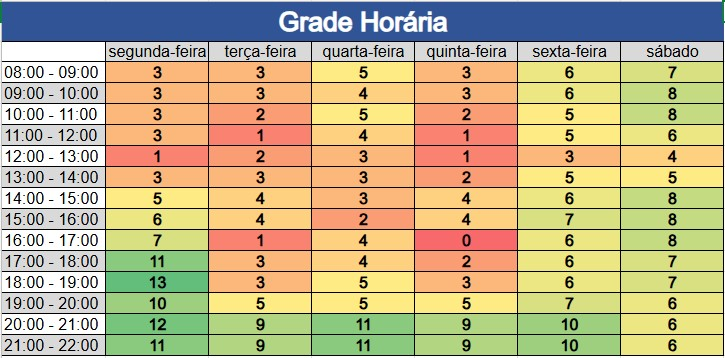

# Plano de Comunicação 

## 1. Introdução

Esse documento busca apresentar como o grupo se planejou em relação a comunicação que ocorrerá durante o semestre. Serão esclarecidos os planos para a comunicação. Além disso, as ferramentas de comunicação são apresentadas.

## 2. Mapa de Calor

Em ordem do grupo saber os melhores horários de disponibilidade para encontros do grupo, um mapa de calor foi feito. Com isso, foi possível definir quando as principais reuniões do grupo aconteceriam. O mapa de calor pode ser visto pela imagem abaixo:

O Quadro está organizado por tonalidades de verde até o vermelho, sendo que quanto mais verde maior a disponibilidade do grupo sendo um total de 14 membros e quanto mais vermelho menor a disponibilidade dos membros.

## 3. Comunicação Interna

A comunicação do time vai ser realizada utilizando a metodologia ágil Scrum, com algumas alterações, serão utilizados 3 ritos principais:

1. Planning: planejamento das tarefas da Sprint;
2. Review + Retrospectiva: revisar o que foi feito durante a Sprint e ter discussões de como ela foi conduzida.
3. Reunião de Acompanhamento: Reunião para acompanhar como está o desenvolvimento da sprint.

Dessa forma, os horários dessas reuniões foram decididos para acontecer de acordo com a tabela abaixo:

| Reunião | Quando acontece | Membros esperados |
| :-----: | :-------------: | :---------------: |
| Planning | Quarta 20h - 21h | Todos de EPS e MDS |
| Review + Retrospectiva | Segunda 18h - 19h (Logo após o término da Reunião com o PO) | Todos de EPS e MDS |
| Reunião de Acompanhamento| Terça e Quinta 16h (Logo após o fim da aula de EPS) | Todos de EPS e MDS |

A equipe está livre para realizar algumas reuniões a mais do que o previsto de acordo com a necessidade.

## 4. Comunicação Externa

As reuniões com o PO (Caio) e o professor (Hilmer) estão, inicialmente, programadas para ocorrerem toda **Segunda às 17h**, com duração esperada de 1h. Todos os membros de EPS e MDS são esperados na reunião.

## 5. Ferramentas

| Ferramenta | Descrição de uso no projeto |
| :--------- | :-------------------------- |
| Discord | Realização das reuniões síncronas e comunicação assíncrona por chat |
| Github | Repositório com issues e documentações |
| Microsoft Teams | Realização de reuniões em que seja importante a gravação |
| Telegram | Responsável pela comunicação rápida da equipe interna |
| Zenhub | Acompanhamento da realização do projeto (quadro Kanban), juntamente com Roadmap |

## 6. Versionamento do Documento

| Data | Versão | Descrição | Autor |
| :-----: | :-------------: | :---------------: | :-: |
| 04/11/2024 | 1.0 | Versão inicial no documento | [Artur Vinicius](https://github.com/ArturVinicius) |
| 08/12/2024 | 2.0 | Adicionando nova comunicação interna | [Artur Vinicius](https://github.com/ArturVinicius) |
