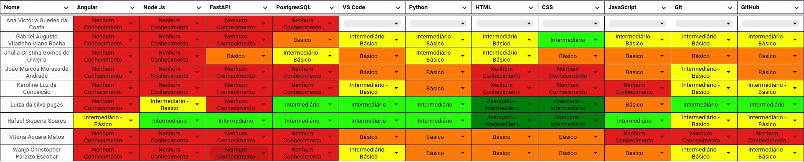
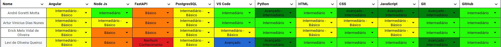

# Quadro de Conhecimentos

## 1. Introdução

Esse documento tem como objetivo apresentar o quadro de conhecimento da equipe, destacando as competências, habilidades e experiências individuais com as tecnologias que utilizaremos no projeto. Este levantamento permite identificar pontos fortes, lacunas de conhecimento e oportunidades de desenvolvimento, fornecendo uma base estratégica para definir o treinamentos e as equipes de desenvolvimento.

## 2. Quadro de Conhecimentos da Equipe

Levando em consideração as tecnologias iniciais e básicas do projeto, as seguintes tecnologias foram colocadas para avaliação dos membros:

1. Angular: Um framework de desenvolvimento web, usado em aplicações front-end;
2. FastAPI: Framework utilizado para a construção de APIs web com python;
3. Git: Sistema de controle de versão;
4. Github: Plataforma para hospedar os respositório de código e documentação;
5. HTML/CSS: Linguagem de marcaçãoi e linguagem de estilo usadas para estruturas e apresentar páginas web;
6. JavaScript: Linguagem de programação utilizada para adicionar interatividade e funcionalidade a páginas web;
7. NodeJS: Ambiente de execução código JavaScript do lado do servidor, multiplataforma e de código aberto;
8. Python: linguagem utilizada para o BackEnd;
9. VSCode: Editor de código-fonte.

A partir disso, foi fornecimento 2 formulários para os integrantes do time de MDS e EPS para definir o nível de conhecimento com a seguinte legenda:

- **Nenhum Conhecimento** : Nunca ouvi falar, ou não tenho nenhum nível de conhecimento;
- **Básico**: Já ouvi falar, porém meu nível de conhecimento e bem inicial;
- **Básico-Intermediário**: Mexi um pouco e estou começando a entender as funcionalidades tendo consciencia;
- **Intermediário**: Conheço bem e consigo me virar sozinho;
- **Intermediário-Avançado**: Já utilizei bastante a tecnologia e sei muita coisa.
- **Avançado**: Sou experiente com a tecnologia. 

Dessa forma, pode ser visto abaixo os quadros de conhecimentos resultante da equipe.

# Quadro de Conhecimento de MDS

# Quadro de Conhecimento de EPS

[Quadro de Conhecimento](https://docs.google.com/spreadsheets/d/1_5or7KDGX6dye1MrN5CbT1Py95UaBFa98Dzc4lQKjy4/edit?resourcekey=&gid=1922773119#gid=1922773119)

## 3. Versionamento do Documento

| Data | Versão | Descrição | Autor |
| :-----: | :-------------: | :---------------: | :-: |
| 09/12/2024 | 1.0 | Criação do documento | [Artur Vinicius](https://github.com/ArturVinicius) |
| 16/12/2024 | 2.0 | Adicionando Quadro de conhecimento de EPS | [Artur Vinicius](https://github.com/ArturVinicius) |