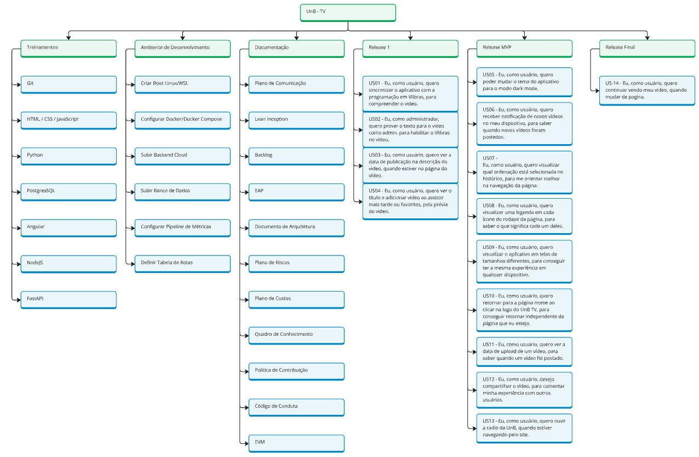

# Estrutura Analítica do Projeto (EAP)

## 1. Introdução

A Estrutura Analítica do Projeto (EAP) é uma ferramenta essencial de gerenciamento de projetos que auxilia na organização e no planejamento sistemático das atividades e entregas de um projeto. Ela é uma representação hierárquica e detalhada de todas as partes que compõem o trabalho necessário para alcançar os objetivos do projeto.

Por meio da EAP, o projeto é decomposto em níveis sucessivos de detalhamento, começando pelos principais entregáveis e dividindo-os em partes menores e mais gerenciáveis, conhecidas como pacotes de trabalho. Essa abordagem permite que a equipe tenha uma visão clara e abrangente de tudo o que precisa ser realizado, facilitando o controle, a comunicação e a identificação de responsabilidades.

A EAP é amplamente utilizada para alinhar expectativas entre stakeholders, reduzir ambiguidades no escopo e garantir que nenhuma atividade importante seja esquecida durante o planejamento e a execução do projeto. Ela serve como base para outras etapas do gerenciamento, como a definição de cronogramas, orçamentos e alocação de recursos.

## 2. EAP do Projeto

Segue o EAP do Projeto UnB-TV.

## 3. Versionamento do Documento

| Data | Versão | Descrição | Autor |
| :-----: | :-------------: | :---------------: | :-: |
| 09/12 /2024 | 1.0 | Criação do Documento | [Artur Vinicius](https://github.com/ArturVinicius) |